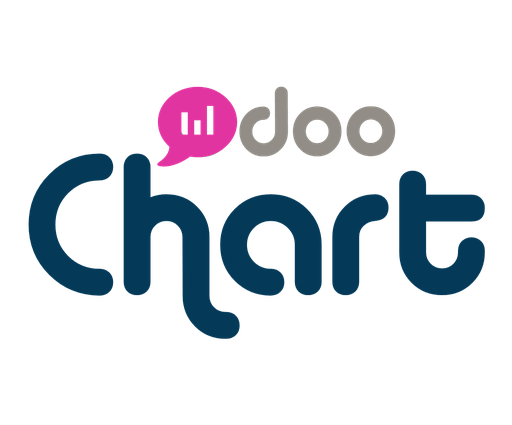

# Chart Odoo - Página Web Oficial



## 🌟 Descripción

Página web oficial de **Chart Odoo**, especialistas en implementación de Odoo con Inteligencia Artificial para empresas de Latinoamérica y España. Somos **Community Partner oficial** y **miembros de la OCA** (Odoo Community Association).

### ✨ Características Principales

- 🤖 **Integración con IA** - Implementaciones inteligentes y automatizadas
- 🌎 **Cobertura LATAM** - Red de aliados en México, Colombia, Argentina, Chile y España
- 🏆 **Community Partner** - Certificación oficial de Odoo
- 📧 **Formularios funcionales** - Sistema de contacto con EmailJS
- 📱 **Diseño responsive** - Optimizado para todos los dispositivos
- 🎨 **Branding profesional** - Logo oficial y colores corporativos

## 🚀 Tecnologías Utilizadas

- **Next.js 15** - Framework React con TypeScript
- **Tailwind CSS** - Estilos y diseño responsive
- **shadcn/ui** - Componentes de interfaz
- **EmailJS** - Sistema de envío de emails
- **Biome** - Linting y formateo de código
- **Bun** - Runtime y package manager

## 🛠️ Instalación y Configuración

### Prerrequisitos

- **Node.js** 18+ o **Bun** (recomendado)
- Cuenta en **EmailJS** para el sistema de contacto

### 1. Clonar el repositorio

```bash
git clone https://github.com/tu-usuario/chart-odoo-website.git
cd chart-odoo-website
```

### 2. Instalar dependencias

```bash
# Con Bun (recomendado)
bun install

# O con npm
npm install
```

### 3. Configurar variables de entorno

Copia el archivo de ejemplo y configura tus variables:

```bash
cp .env.local.example .env.local
```

Edita `.env.local` con tus credenciales de EmailJS:

```env
NEXT_PUBLIC_EMAILJS_SERVICE_ID=tu_service_id
NEXT_PUBLIC_EMAILJS_TEMPLATE_ID=tu_template_id
NEXT_PUBLIC_EMAILJS_PUBLIC_KEY=tu_public_key
NEXT_PUBLIC_CONTACT_EMAIL=juancarlos@chart-e.com
```

### 4. Configurar EmailJS

Sigue las instrucciones detalladas en [`EMAILJS_SETUP.md`](EMAILJS_SETUP.md) para:
- Crear cuenta en EmailJS
- Configurar servicio de email
- Crear templates de email
- Obtener las credenciales necesarias

### 5. Ejecutar en desarrollo

```bash
# Con Bun
bun run dev

# O con npm
npm run dev
```

La aplicación estará disponible en [http://localhost:3000](http://localhost:3000)

## 📁 Estructura del Proyecto

```
chart-odoo-website/
├── public/
│   └── chart-odoo-logo.png     # Logo oficial
├── src/
│   ├── app/
│   │   ├── globals.css         # Estilos globales y colores Odoo
│   │   ├── layout.tsx          # Layout principal
│   │   └── page.tsx            # Página principal
│   ├── components/
│   │   ├── ui/                 # Componentes shadcn/ui
│   │   └── DemoForm.tsx        # Formulario de contacto
│   ├── lib/
│   │   ├── utils.ts            # Utilidades
│   │   └── emailService.ts     # Servicio de EmailJS
│   └── types/
│       └── global.d.ts         # Tipos globales
├── .env.local.example          # Variables de entorno ejemplo
├── EMAILJS_SETUP.md           # Guía de configuración EmailJS
└── README.md                  # Este archivo
```

## 🎨 Personalización

### Colores Corporativos

El diseño utiliza la paleta oficial de Odoo:

```css
:root {
  --odoo-primary: #2d2c39;    /* Azul marino principal */
  --odoo-secondary: #976372;   /* Púrpura secundario */
  --odoo-teal: #2bbccc;       /* Turquesa para acentos */
  --odoo-orange: #eaab41;     /* Naranja para destacados */
}
```

### Componentes Principales

- **Header** - Navegación con logo y CTAs
- **Hero Section** - Mensaje principal con IA
- **Módulos** - Showcase de aplicaciones Odoo
- **Testimonios** - Casos de éxito reales
- **Red de Aliados** - Cobertura LATAM
- **Formulario Demo** - Contacto con validación
- **Footer** - Enlaces y información corporativa

## 👥 Testimonios Reales

La página incluye testimonios auténticos de:

- **Sergio Espino** - CEO, La Gurvia (México)
- **Alfredo Gadsden** - CEO, Grupo Escato (México)
- **Vicente Viniegra** - Socio Director Aliado Odoo, Pridecta (España)

## 📧 Sistema de Contacto

### Funcionalidades

- ✅ Validación de formularios en tiempo real
- ✅ Envío de emails automático a Chart Odoo
- ✅ Confirmación automática al usuario
- ✅ Manejo de errores y estados de carga
- ✅ Tracking de conversiones (Google Analytics)

### Templates de Email

El sistema incluye templates profesionales para:
1. **Notificación interna** - Datos del prospecto para Chart Odoo
2. **Confirmación usuario** - Email automático de confirmación

## 🚀 Despliegue

### Netlify (Recomendado)

```bash
# Build para producción
bun run build

# El proyecto se puede desplegar directamente en Netlify
# Las configuraciones están en netlify.toml
```

### Vercel

```bash
# Build para producción
bun run build

# Compatible con Vercel out-of-the-box
```

### Variables de Entorno en Producción

Asegúrate de configurar las variables de entorno en tu plataforma de despliegue:

- `NEXT_PUBLIC_EMAILJS_SERVICE_ID`
- `NEXT_PUBLIC_EMAILJS_TEMPLATE_ID`
- `NEXT_PUBLIC_EMAILJS_PUBLIC_KEY`
- `NEXT_PUBLIC_CONTACT_EMAIL`

## 🔧 Scripts Disponibles

```bash
# Desarrollo
bun run dev

# Build para producción
bun run build

# Iniciar servidor de producción
bun start

# Linting
bun run lint

# Formateo de código
bun run format
```

## 🤝 Contribuciones

Para contribuir al proyecto:

1. Fork el repositorio
2. Crea una branch para tu feature (`git checkout -b feature/nueva-feature`)
3. Commit tus cambios (`git commit -am 'Añadir nueva feature'`)
4. Push a la branch (`git push origin feature/nueva-feature`)
5. Abre un Pull Request

## 📝 Licencia

Este proyecto es propiedad de **Chart Odoo**. Todos los derechos reservados.

## 📞 Contacto

- **Email**: juancarlos@chart-e.com
- **Teléfono**: +52 55 3362 9528
- **Website**: [chartodoo.com](https://chartodoo.com)

---

**Chart Odoo** - *Potenciado por Inteligencia Artificial* 🤖

*Community Partner Oficial | Miembro OCA | Fábrica de Odoo para LATAM y España*
